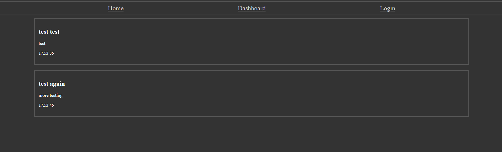

# CMS blog
This site is a simple blogging site test which lets you make posts to the main screen.

# usage
install the required dependancies, run the server and connect via localhost or via the display at heroku here:  
https://turbo-spork-2c7f90bed534.herokuapp.com/  
You will also need to set up a .ENV to match the following variables according to your needs:  
SIGNATURE= A signature for cookies on the site. (recommend generating your own personal string via something like Bcrypt)  
DB_USER=  the username for database  
DB_PW=    password for the database   
DB_NAME=  name of the database.  
An example ENV is provided in the root directory. (If you choose to use this you MUST rename it!)  

# credits 
heroku, for deployment, and all the used packages indicated in package.json.
all credits for the used packages belong to the respective code owners.

# Example screenshot
